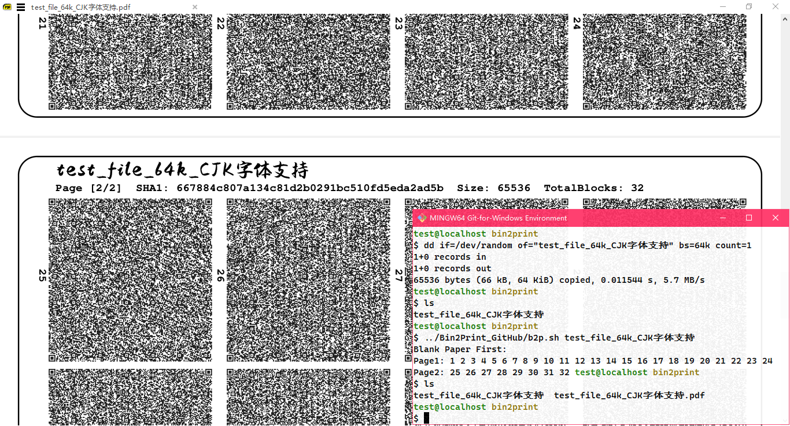

# bin2print
Back up your important binary data in QR code matrix with printed paper.

Convert binary to full vector image PDF file or print directly without temporary files.

** THIS PROJECT IS STILL IN A VERY VARY EARLY STAGE, SO DON'T USE IT FOR CRITICAL USE AND PRODUCTION ENVIRONMENTS. **

# Dependencies
- [Bash](https://www.gnu.org/software/bash/)
- [Gawk](https://www.gnu.org/software/gawk/)
- [Coreutils](https://www.gnu.org/software/coreutils/)
- [QREncode](https://github.com/fukuchi/libqrencode)
- [Ghostscript](https://ghostscript.com/)

# Usage



## Encode

The script will place a blank page as a separator for you
to find a place in the multiple prints,
you will need to manually design an actual cover later.<br>
If you see a blank page in your pdf result, just scroll down to the second page.<br>
If you want to use a special TTF font file as the title typeface,
you need to manually modify the script.<br>
Defines the value of `/F2` as an alias defined in cidfmap.<br>
Ghostscript needs to know the font definitions in '${GS_PATH}/lib/cidfmap'.<br>

```sh
## create a test file in any writable path
dd if=/dev/random of=test_data_block_64k bs=64k count=1
## run the shell script, the only parameter is filename to encode
where/I/put/b2p.sh test_data_block_64k
## then the script will generate $1.pdf to the writable path
## here $1 is test_data_block_64k
## BE WARY OF OVERWRITING YOUR IMPORTANT FILES NAMED $1.PDF
```

## Decode

Change dir into your HD scan picture path,
then use this Bash One-Liner to call zabrimg to restore your data.<br>
Here I assume that your scanned file name is scan-1 scan-2 ...<br>
Copy these two lines but without newline character, paste them into terminal and execute.<br>
If your scanned pictures are of good quality, the data can be easily recovered.

```sh
for f in scan*; do where/bin2print/is/bin/zbarimg.exe --raw -q $f; done |
  sort | sed 's/^[<][[:digit:]]\+[>]//g' | base64 -d > original_file
```

However, the zbar recognition is not stable, and I'm still thinking about a solution.
But I don't want to sacrifice encoding density.

# GNU/Linux Installation

Install qrencode and zbar using your package manager.

# MS Windows Installation

## Download dependencies

- [MSYS2](https://www.msys2.org/)

  Or

- [Git-for-Windows](https://git-scm.com/download/win)
- [QREncode for Windows](https://sourceforge.net/projects/qrencode-for-windows/)
- [ZBar](https://github.com/mchehab/zbar)
- [Ghostscript AGPL Release](https://ghostscript.com/releases/gsdnld.html)

## ZBar in Windows

The [official zbar](https://github.com/mchehab/zbar) lacks dlls and cannot be used directly, so we need to add the missing library files.

### (Option1) MSYS2 Environment

Install zbar with pacman is very easy.

```sh
pacman -Syy
pacman -S mingw-w64-ucrt-x86_64-zbar
```

If you want to build it yourself, following instructions in
[mchehab/zbar - README-windows.md](https://github.com/mchehab/zbar)

### (Option2) Git for Windows Environment

1. Make a Zbar standalone installation for other MS Windows

If you want to create a zbar installation package for another computer,
you need a MSYS2 ucrt64 enviroment firstly.<br>
Then execute the following command. My released package was made like this.<br>
Otherwise, you can also download MSYS2 `pkg.tar.zst` packages manually from any mirror.
You can search and get information from [MSYS2 Packages](https://packages.msys2.org/search).

```sh
pacman -Syy
## install zbar and its dependencies for preparing dlls
pacman -S mingw-w64-ucrt-x86_64-zbar
## create temporary directory
mkdir -pv ~/b2p_tmp && cd ~/b2p_tmp && pwd
## download msys2 package
pacman -Sw --noconfirm mingw-w64-ucrt-x86_64-{imagemagick,zbar}
cp -v /var/cache/pacman/pkg/mingw-w64-ucrt-x86_64-{imagemagick,zbar}-*.zst ~/b2p_tmp
## untar what we need
tar xvf mingw-w64-ucrt-x86_64-imagemagick-*.zst --wildcards ucrt64/lib ucrt64/share/licenses ucrt64/bin/*.dll
tar xvf mingw-w64-ucrt-x86_64-zbar-*.zst ucrt64/bin ucrt64/share/licenses
## do some tailoring
find ucrt64 '(' -name '*.a' -o -name 'libMagick++*' -o -name 'zbarcam.exe' \
  -o -iname 'pkgconfig' -o -iname 'config-Q16HDRI' ')' -exec rm -rvf {} \;
## find and copy DLLs we need
cd ~/b2p_tmp/ucrt64/bin
for f in *; do echo "----- $f -----"; ldd $f | egrep -iv system32 | awk '{print $3}' | xargs -I{} cp -v "{}" .; done
cd ~/b2p_tmp
```

2. Generate a testing QR Code PNG image by qrencode

you can download [QREncode for Windows](https://sourceforge.net/projects/qrencode-for-windows/)
and unzip it manually or install it in MSYS2 Environment with pacman.

```sh
## create temporary directory
cd ~/b2p_tmp && pwd
## generate qr code
#qrencode -otest.png -s1 -m2 -lL -v1 --strict-version -tPNG "Hello World!"
## here I copied qrencode.exe into ~/b2p_tmp/ucrt64/bin
ucrt64/bin/qrencode -otest.png -s1 -m2 -lL -v1 --strict-version -tPNG "Hello World!"
```

3. open Windows CMD.EXE to test

```bat
cd %YOUR_MSYS_HOME%\b2p_tmp\
REM if your zbar is working properly, you will get output as "Hello World!"
ucrt64\bin\zbarimg.exe -q --raw test.png
```

4. Now we have a standalone zbar installation. You can archive and distribute it as you like.

```sh
cd ~/b2p_tmp && pwd
mv -v ucrt64 zbar-0.23.91-win_x86_64-standalone
7z a -mm=Deflate -mfb=258 -mpass=15 -r zbar-0.23.91-win_x86_64-standalone{.zip,}
```

# TODO
- add parameter parsing function.
  - specify the output filename.
  - multiple input and multiple output.
  - call the specified printer to print directly (Win gs / CUPS gs).
- error Handling, existence Checks.
- automatically calculate centering and scaling based on qr code matrix layout.
- test on more operating systems.
